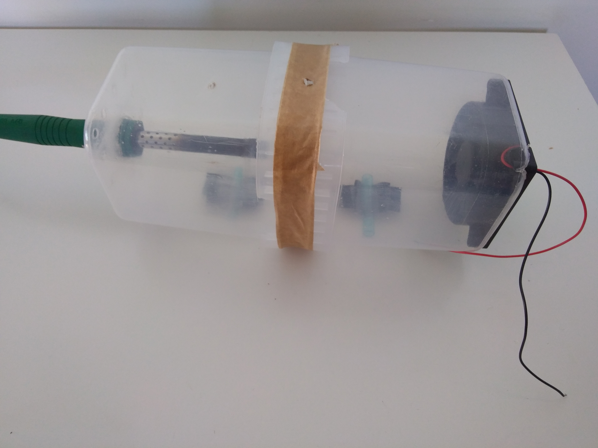
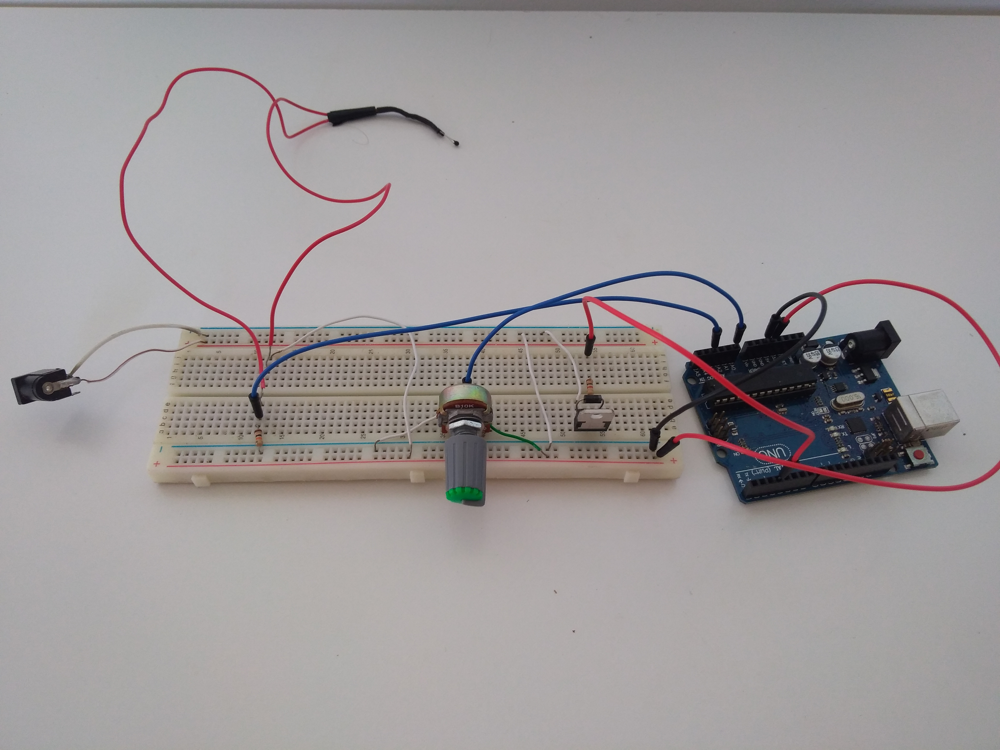

<h1 align="center"> Controle de Temperatura </h1>

Projeto desenvolvido durante a disciplina de Controle Integrador, para automatizar o controle de temperatura em um ambiente fechado.  

  <a href="#-tecnologias">Tecnologias</a>&nbsp;&nbsp;&nbsp;|&nbsp;&nbsp;&nbsp;
  <a href="#-projeto">Projeto</a>&nbsp;&nbsp;&nbsp;|&nbsp;&nbsp;&nbsp;
  <a href="#-layout">Documentação</a>&nbsp;&nbsp;&nbsp;|&nbsp;&nbsp;&nbsp;

 

  

  

## 🚀 Tecnologias

Esse projeto foi desenvolvido com as seguintes tecnologias e conceitos:

- Sistemas embarcados (ARDUINO)
- Controle PID
- C++
- MatLab (Ident, Simulink)
- Git e Github

## 💻 Projeto

O objetivo deste trabalho é controlar a temperatura de um ambiente fechado, que tem um aquecimento interno promovido por uma resistência elétrica, através da ação de uma ventilação forçada gerada por um cooler. A lógica de controle será a de um controlador digital obtido por meio de técnicas de modelagem caixa preta, que por vez estará embarcado numa placa de desenvolvimento Arduíno UNO R3. O sistema será composto também por um termistor NTC para monitorar a temperatura, realimentando o sinal de leitura para fazer o cálculo do erro.

- [Acesse a apresentação do projeto finalizado, online](https://www.youtube.com/watch?v=NoqnCxcfjEA&list=PL_6nM0tbfOs9ClvoL8Nbj3QzpXwokxaAQ&index=4&ab_channel=LuisGustavoOliveira)

## 🔖 Documentação

A documentação principal do projeto pode ser acessada na pasta [docs](./docs/Gabriel%20Henrique%20e%20Luis%20Gustavo%20-%20Projeto%20Final.pdf), no qual é o artigo com os resultados do projeto.

---
